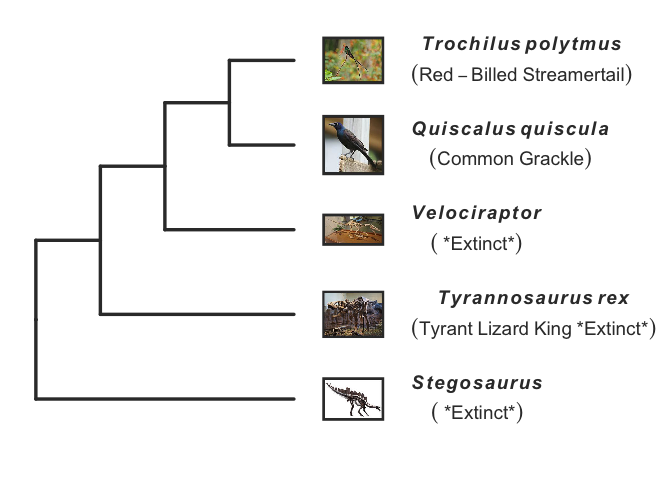
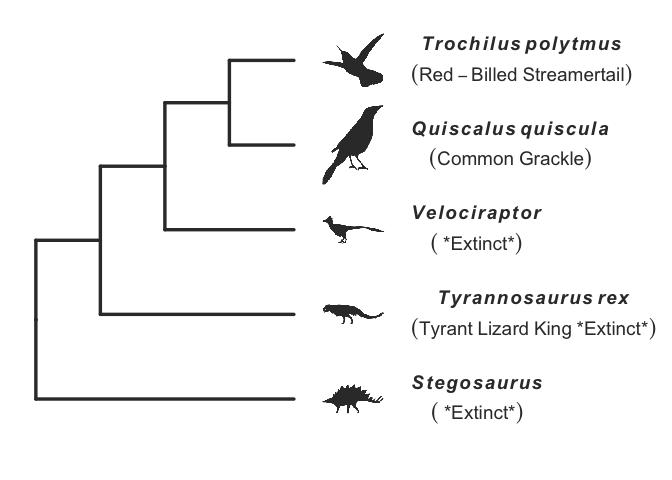

<!-- README.md is generated from README.Rmd. Please edit that file -->

# galacticEdTools

<!-- badges: start -->

[](https://lifecycle.r-lib.org/articles/stages.html#experimental)
<!-- badges: end -->

GalacticEdTools is an R Stats package to support K-16 education and
scicomm. Largely, these are functions developed to support lessons
created by [Galactic Polymath Education
Studio](www.galacticpolymath.com), and have been made available to the R
community. Functions do a variety of things, from making it easy to
generate a phylogeny that’s ready for biology presentations in minutes
to turning any ggplot graph into a fun puzzle by enciphering the graph
labels. There’s lots more to come\!

## Installation

You can install the released version of galacticEdTools from
[GitHub](https://github.com/galacticpolymath/galacticEdTools) with:

``` r
# install.packages("devtools") #install devtools if you don't have it
# devtools::install_github("galacticpolymath/galacticEdTools")
#you may have to install a fair number of dependencies/updates (I'll work on streamlining this at some point)

#load it
require(galacticEdTools) 
#> Loading required package: galacticEdTools
#> Loading required package: datelife
```

## Example

Ever wanted to make a phylogeny to, say, show birds are *actually*
dinosaurs? Did you end up freehanding it in Powerpoint? To teach
evolution, we need to be able to make scientifically accurate trees on
the fly. The showPhylo() function aims to make this as simple as
possible, freeing you up to focus on building out the lesson around this
evolutionary visualization.

So let’s pick some dinosaurs, a dino-actin’ bird like the common
grackle, and a really improbable bird like the red-billed streamertail
hummingbird. I’ll make a vector of these species’ scientific names.

And with no changes to the plot, here’s what it should look like.

``` r
plot(dinos)
```



By default, pic=“wiki”, meaning taxonomic images are pulled in from the
appertaining Wikipedia entry (if available). You can also use phyloPics
(silhouettes, as shown below), or supply your own images. Check out the
vignette for showPhyloPic() to learn about more customizations.

``` r
plot(dino2)
```


