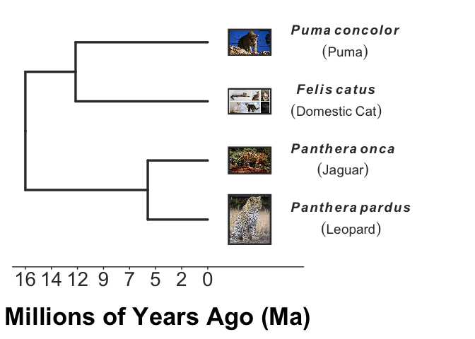
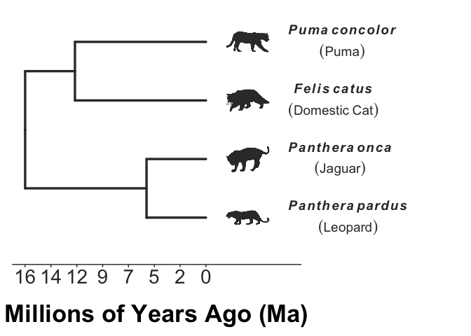

<!-- README.md is generated from README.Rmd. Please edit that file -->

```{r, include = FALSE}
require(galacticEdTools)
knitr::opts_chunk$set(
  collapse = TRUE,
  comment = "#>",
  fig.path = "man/figures/README-",
  out.width = "100%",
  warning=FALSE, message=FALSE
)
```

# galacticEdTools

<!-- badges: start -->
[](https://lifecycle.r-lib.org/articles/stages.html#experimental)
<!-- badges: end -->

An [](https://www.r-project.org/) package to support K-16 education and scicomm. This code was developed by [Galactic Polymath Education Studio](www.galacticpolymath.com) to solve teaching and visualization challenges associated with our lessons. The functions do a variety of things, from making it easy to generate a dated phylogeny that's ready for biology presentations in minutes to turning any ggplot graph into a fun puzzle by enciphering the graph labels. There's lots more to come!

## Installation

> *Before you start (or if you run into errors), consider updating [R to ver 4.1.0 or better](https://mirror.las.iastate.edu/CRAN/) and [Rstudio ver 1.4.1717 or better](https://www.rstudio.com/products/rstudio/download/).

The package is not on CRAN yet, but you can install the latest version from [GitHub](https://github.com/galacticpolymath/galacticEdTools) with:

``` {r, "load-package", results="hide", eval=F}
# install.packages("devtools") #you need devtools to install from github
devtools::install_github("galacticpolymath/galacticEdTools")
#* may have to install a fair number of dependencies/updates (I'll work on streamlining this at some point)

#load it
require(galacticEdTools)
#require(datelife) If you get an error about taxa not being found in any chronograms, try this
```

## Example

The impetus for this package was the need to make a figure showing that the many animals we call "panthers" are actually really distantly related cat species. Our genetic rescue lesson, sponsored by [Dr. Sarah Fitzpatrick's lab](http://swfitz.com/), uses the example of the Florida panther as a charismatic application of her research (which mostly uses guppies as a model for understanding how gene flow can save small, highly inbred populations from extinction). The figure below was essential for explaining that 1) black panthers are not a species at all, but the (uncommon) dark morph of either a leopard or jaguar, and 2) that these big cats diverged from Florida panthers (which are actually pumas/cougars/mountain lions) around 16 million years ago.

This type of dated phylogenetic tree should be an essential teaching tool for so many lessons in biology, but it requires a lot of time, programming skill, and know-how to create. Our show_phylo() function makes it possible in just a couple lines of code. It's essentially a convenience wrapper that merges functionality from several R packages: chiefly [taxize](https://github.com/ropensci/taxize), [datelife](https://github.com/phylotastic/datelife), [ggtree](https://github.com/YuLab-SMU/ggtree), [ggplot2](https://github.com/tidyverse/ggplot2), [phylopic](https://github.com/sckott/rphylopic),  [WikipediR](https://github.com/Ironholds/WikipediR) & many others. 


``` {r, "read-in-species", results="hide", eval=F}
# I want to show that Florida panthers are highly diverged from leopards and jaguars,
# and are actually (a bit) more closely related to domestic cats
speciesNames <- c("puma","leopard","jaguar","domestic cat")

# Now,let's make a phylogeny for these species. Just declare that these are 
# common names, and showPhylo should make some reasonable assumptions to make a pretty plot,
# and by default add scientific names and the cover pictures from Wikipedia using our 
# getWikiPic() function.
cats<-showPhylo(speciesNames,nameType="common")
```

And with no changes to the plot, here's what it should look like.
``` {r first-catphylo, eval=F}
plot(cats)
```


By default, pic="wiki", but we can also use pic="phylopic" to get species silhouettes from the [phyloPics image repository](http://phylopic.org/). You can also supply your own images with pic="cust". Check out the vignette for showPhylo() to learn about more customizations. (not done yet)

``` {r include=F, eval=F}
cats2<-showPhylo(speciesNames,"c",pic="phylopic")
```
``` {r second-catphylo, eval=F}
plot(cats2)
```


## Is this package useful to you? There are several ways you can support its continued development.
1. Use it! And tag [\@galacticPM](https://twitter.com/GalacticPM) & [\@mattwilkinsbio](https://twitter.com/mattwilkinsbio) in a Tweet showcasing what you made.
2. [Sign up for our mailing list](https://eepurl.com/g_kQ4T) and let G5-16 teachers in your network know about our [free lessons and tools](https://www.galacticpolymath.com).
3. If you're a researcher who needs to do outreach, [hire us](https://www.galacticpolymath.com/hire-us) to make your Broader Impacts an easier lift, with higher production, and greater reach.
4. Help us out! We want to streamline the transfer of knowledge from Academia into K-12 schools by offering unbelievably high quality, interdisciplinary lessons that are free for teachers. As a self-funded startup, we depend on volunteer and friendly contract labor from skilled developers (react.js, HTML, CSS, R, D3), graphic designers, artists, education experts and social media influencers. If you want to be part of the GP team, reach out to [matt@galacticpolymath.com](mailto:matt@galacticpolymath.com).
